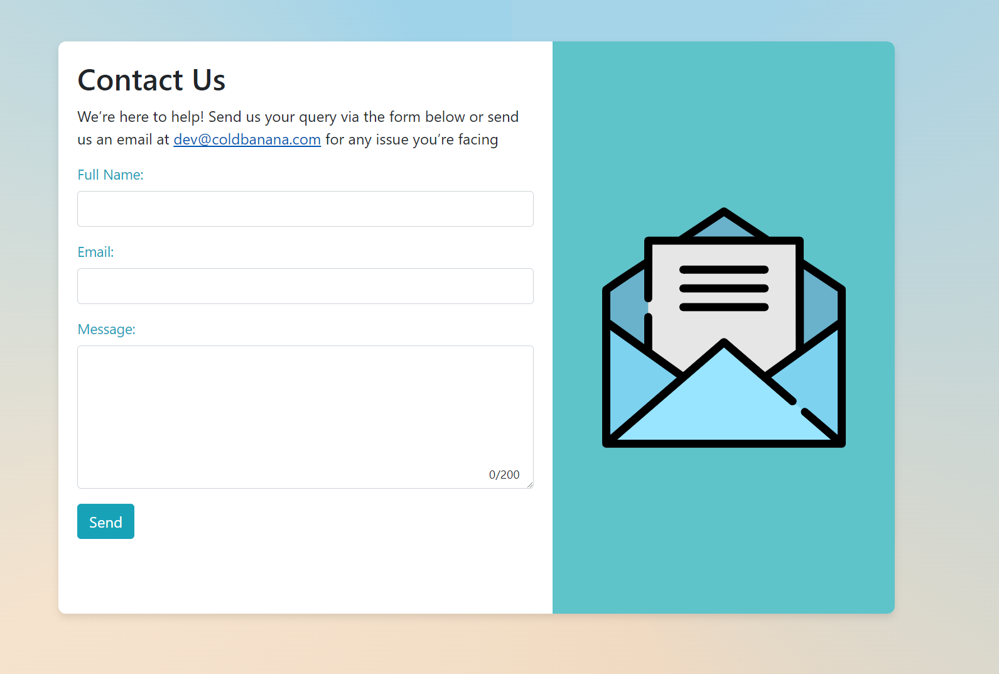

---

# Cold Banana Test
### **Umbraco Contact Us Page Implementation**

This project outlines a contact page implementation using Umbraco version 10.6.1 and .NET 6.0.413.

**I understand this Git might be ugly but I was unsure of the dependencies that Umbraco needs**

### Method of sending the email
Since running our own mail server would not be the greatest due (due to hosting and spam filters) and for the sake of the simplicty of this project, I had setup a simple Gmail account with the details exposed via the JSON file (I know I did) that has 2FA enabled and generated App Passwords for it (only way to get gmail running with SMTP, that I know of)

### **Requirements:**

- **Umbraco:** v10.6.1 (latest LTS version)
- **.NET:** v6.0.413

### **Document Types:**

1. **Base page (No Template)**:

    - **Group:** Content
        - **Property:** `pageTitle` (Textstring) - This serves as the title for each page.
    
2. **Contact Us Page (With Template)**:

    - **Group:** Form Inputs
        - **Property:** 
            - `Recipient Email Address` - Designates the email that should receive the contact form submissions.
            - `Success Message` - Message displayed to the user after a successful form submission.
            - `Error Message` - Message displayed to the user in case of a form submission error.
            - `Message Max Length` - Defines the maximum character length for the contact message.
            - `EmailTemplate` - Reference to the Email Template content.

    - **Group:** Content (Inherited from Base Page)
        - **Property:** 
            - `pageTitle` (Textstring)

    - **Group:** Form Content
        - **Property:** 
            - `Form Heading` - Title for the contact form.
            - `Form Introduction` - Short guiding paragraph for users.
            - `Form Image` - Image displayed alongside the contact form (typically an SVG).

3. **Email Template (Without Template)**:

    - **Group:** Content
        - **Property:** 
            - `bodyTemplate` (Richtexteditor) - The main content of the email. 
            - `subject` (Textstring) - Subject of the email.

### **Content Nodes:**

- **Contact Us**:
    - **URL Path:** `/`
    - Acts as the main contact page.
  
- **Email Template**:
    - Inaccessible externally. 
    - Used internally as a template for the Contact Us email submissions.

### **Features & Implementation Details:**

- **Validations:** Both front-end and back-end validations are employed. This was accomplished using the model's constraints.
  
- **Email Templating:** Email content is dynamically set using placeholders for user input. The placeholders include:
    - `{{Name}}`
    - `{{Email}}`
    - `{{Message}}`

- **Error Handling:** Comprehensive error handling mechanisms are in place, covering both the client and server sides.

